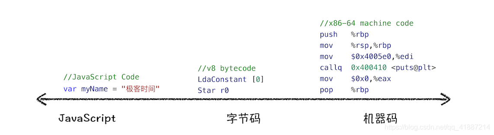

### 编译原理
机器无法理解开发人员写的代码，在执行程序前，需要用编译器和解释器将所写的代码”翻译“成机器能读懂的机器语言。

**编译型语言**   
编译型语言在程序执行前，需要经过编译器的编译过程，编译后保留机器能读懂的二进制文件，这样每次运行程序时，都可以直接运行该二进制文件，无需再次重新编译。如，C/C++

**解释型语言**  
解释型语言编写的程序，在每次运行事都需要通过解释器对程序进行动态解释和执行。如，python、js都属于解释型语言

### V8 如何执行一段js代码


**AST**
Babel 的工作原理就是将ES6的源码转成AST，然后再将ES6语法的AST转换为ES5语法的AST，最后利用ES5的AST 生成js源码

Eslint 检测js编写规范的插件，将源码转成AST，然后在利用AST检查代码规范化问题


### 生成AST的过程：先分词，再解析
第一步：分词 tokenize 
    token：语法上不能再分的、最小的单个字符或字符串

    ```
        var name = "June";
    ```
    会生成4个不同属性的token： 
        - 关键词： var
        - 标识符： name
        - 赋值运算符： =
        - 字符串： June


第二阶段：解析（parse），语法分析
将上一步生成的token数据，根据语法规则转成AST。如果代码存在语法错误，这一步就会终止，抛出语法错误。


第三步：执行代码
**解释器** 解释器根据AST生成字节码，解释器执行字节码。在执行字节码过程中，遇到热点代码（一段代码被重复执行多次，这种代码被称为热点代码），**编译器**会将热点的字节码转成机器码，再次执行代码时就可执行机器码，提升执行效率。

        ** 什么是V8 **
        是chrome提供的 Js引擎的名称，其他浏览器也有自己的js 引擎。
        - firefox 有 spiderMonkey
        - safari 有 Nitro
        - Edge 2020年1月基于 Chromium 和v8引擎
         
        **即时编译（JIT）**
        解释器在执行字节码的同时，手机代码信息，发现某一部分代码变热了后，编译器登场，把热点的字节码转成机器码，并把转换后的机器码保存起来备用。


        ** 字节码 与机器码 **
        早期V8没有字节码，直接将AST转成机器码，但是随着 chrome在手机上的普及，V8需要消耗大量的内存存放转换后的机器码。  
        为了解决内存占用问题引入字节码，字节码需要解释器转换成机器码后才能执行。

        

        > 机器码占用的空间远远超过字节码，所以使用字节码可以减少系统的内存使用


[v8 如何执行一段代码](https://blog.csdn.net/qq_41887214/article/details/108908481)

[AST exploer](https://astexplorer.net/)

[用js 写一个js解释器](https://segmentfault.com/a/1190000017241258)