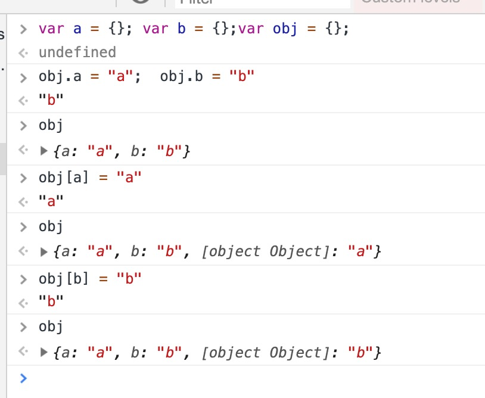

### 类型
类型： 值的内部特征，定义了值的行为，以便区别于其他的值


js 中的变量没有类型，只有值才有类型，变量可以随时持有任何类型的值

```
let a = 2; 
typeof a // 'number'
a = 'hello';
typeof a // 'string'

```

分类：
- 基本类型（Primitive data type）
- 引用类型 （reference data type）

#### 基本数据类型

- boolean
- string
- symbol 
- number
- undefined
- null

** null 和 undefined 区别**

null 含义：表示空值

用途： 
- 作为函数的参数，表示空值
- 作为原型链的终点

undefined 含义：表示缺省值
用途： 
- 变量声明未赋值时
- 函数参数没有提供时
- 对象没有赋值的属性
- 函数没有返回时，默认返回undefined


### number

```
function closeEqual(a, b) { 
    return Math.abs(a - b) < Number.EPSILON;
}

closeEqual(0.1 + 0.2, 0.3) // true
0.1 + 0.2 === 0.3 // false

0.001 + 0.002 === 0.003  // true
 
```

*遇到NaN、-0 时 可以用 Object.is（a， NaN）来比较是否相等*

#### 引用类型
- Function
- Array
    - 类数组转换为真数组： Arr
- RegExp
- Date


### 类数组转换成真数组

- Array.prototype.slice.call(arguments)

```
function test() {
    var a = Array.prototype.slice.call(arguments);
    console.log('a', a); // [1, 2, 3, 4]
    console.log('Array.isArray(a)', Array.isArray(a));  // true
    console.log('Array.isArray(arguments)', Array.isArray(arguments));  // false
}
test(1, 2, 3, 4);

```

-  Array.from(arguments)

```

function test() {
    var a = Array.from(arguments);
    console.log('a', a); // [1, 2, 3, 4]
    console.log('a isArray', Array.isArray(a));  // true
    console.log('arguments isArray', Array.isArray(arguments));  // false
}
test(1, 2, 3, 4);

```

- 展开运算符

```
function test(...rest) {  
    console.log('rest', rest); // [1,2,3,4]
    console.log('rest isArray', Array.isArray(rest));  // true
}  
test(1, 2, 3, 4);

```


#### 复制
- 简单值 通过值复制方式赋值/传递，包括：null、undefined、boolean、string、symbol、number

- 引用类型的值 通过引用复制的方式赋值/传递

  
  通过引用x 更改a和x共同指向的值  
```
    var a = [1, 2, 3];

    function test(x) {
        x.push(4);
        console.log('x', x);  // [1, 2, 3, 4]
    }
    test(a);
    console.log(a);  // [1, 2, 3, 4]

```

**不能通过引用x 更改引用a 的指向**

```
    var a = [1, 2, 3];

    function test(x) {
        x.push(4);
        console.log('x', x);  // [1, 2, 3, 4]
        x = [5, 6, 7];
        x.push(8);
        console.log('x', x); // [5, 6, 7, 8]
    }
    test(a);
    console.log(a);   // [1, 2, 3, 4]

```


##### 深拷贝、浅拷贝
区别：
- 浅拷贝只拷贝引用类型的指针，新旧对象共享同一块内容，导致新旧对象互相影响
- 深拷贝：创造一模一样的对象，新旧对象不共享内存，新旧对象不会互相影响

如何实现深拷贝
- JSON.parse(JSON.stringify()) 
缺点是：JSON.stringify 会忽略 undefined function symbol

- Object.assign
只能实现一维对象的深拷贝

- { ...obj }
同 Object.assign， 只能实现一维对象的深拷贝

> Object.assign 与 { ...obj }区别
es6解构写法性能更优，Object.assign 需修改传入的第一个参数


- 递归
需要注意循坏引用


- Immutable
    - 一旦被创建就不可被修改, 对immutable对象的任何操作都会返回一个新的immutable对象
    - 利用结构共享，避免深拷贝中所有节点都复制一遍带来的性能损耗:对象树中一个节点变化，只修改这个节点和他所影响的父节点，其他节点则共享


### 基本类型和引用类型的区别
- 存放位置不同
    - 基本类型的值存放于栈中
    - 引用类型在栈中存放了指针，指针指向存放于堆中的真实的值

- 比较的值不一样
    - 基本类型比较的是真实的值
    - 引用类型是看其引用是否指向同一个

    ```
    a = [2]; b = a; b === a  // true
    a = [2]; b = [2]; a === b  // false 两个变量内容相同，但是2个变量的是引用类型，存放于堆中的位置不一样，所以2个变量指向的是不同的对象

    ```

- 是否有内置方法
    - 引用类型有内置方法，可以自定义其他方法操作数据
    - 基本类型无内置方法： 利用 基本包装类型 操作数据
    
#### 基本包装类型
用途： 便于操作基本类型值

- String
- Boolean
- Number

时机：读取基本类型的值时，后台就会自动创建一个基本包装类型的对象

```
var  a = "hello"; 
console.log(a); // 读值的时候就会创建基本包装类型

var a = "hello";
var b = a; // 读值的时候会创建基本包装类型
```


** 与引用类型的区别 **
- 对象的生命期不一样
    - 引用类型的数据，在执行流离开当前作用域之前会一直保存于内存中
    - 基本包装类型只存在于一行代码的执行瞬间，执行完毕就会销毁
        - 基本包装类型无法添加属性和方法

```
var a = "hello"; 
a.test = "world"; // 第二行时会自动创建包装类型，String实例在第二行代码结束就会被销毁，test属性就没有了 
console.log(a.test); // undefined  第三行代码时又会自动新创建包装类型实例，此时没有test 属性
```


#### 判断数据类型
- typeof: 可以用来判断基本数据类型
- instanceof: 判断两个对象是否属于实例关系，不可以判断一个对象实例具体属于哪种类型
- constructor: F利用原型链上的constructor引用了自身，当F作为构造函数创建对象时，原型上的constructor就被遗传到了新创建的对象上
- Object.toString(): 可以用来判断所有的数据类型, object 可以直接调用该方法，其他数据类型需要call/apply 才能返回正确的类型信息，支持所有数据类型

```
Object.prototype.toString.call('');//  "[object String]"
```

#### 对象
- 属性名访问，如：obj.a ，属性名必须满足标识符命名规范
    -  标识符命名规范中要求：不能以数字开头，不能包含` - `特殊字符

    ```
    var my-obj = {}; // Uncaught SyntaxError: Unexpected token -
    var obj = { 'my-obj': 22 }; // 可以

    ```

- 键访问，如： obj[a] ，可以接受任意字符串，健会被转换为 string
  


参考资料：



    


[判断js数据类型的4种方法](https://www.cnblogs.com/onepixel/p/5126046.html)