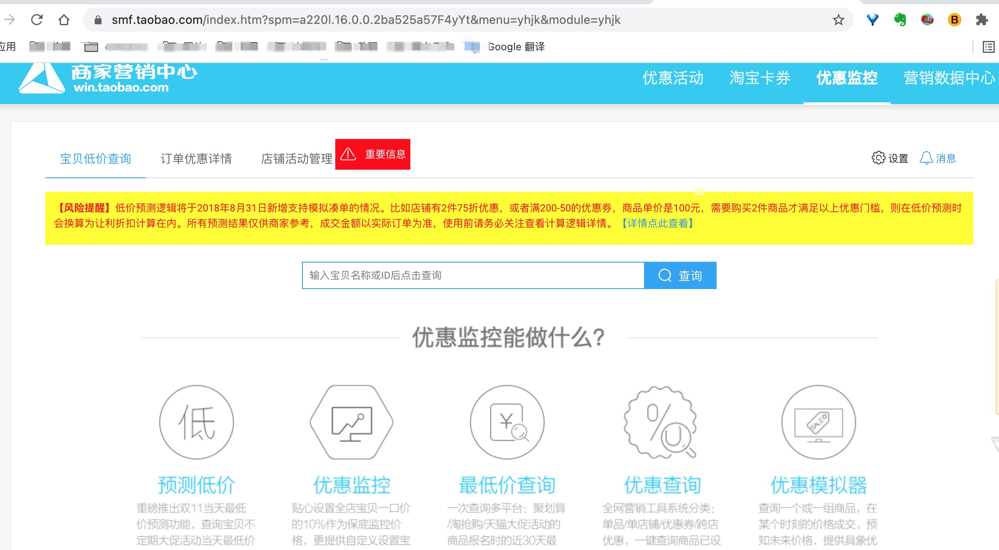
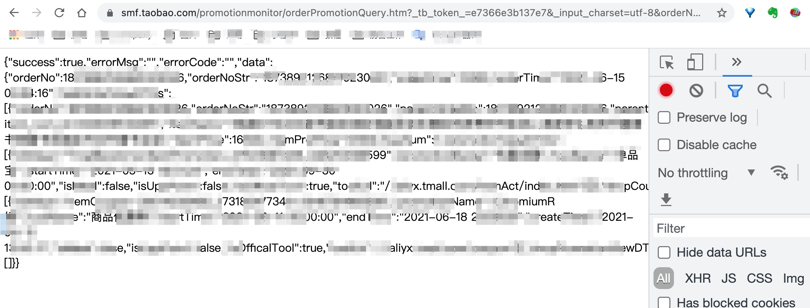
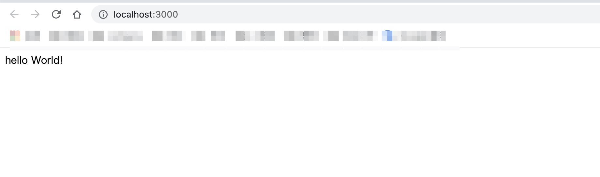

### GET 类型的API爬虫

项目地址： [nodejs-getApi](http://github.com/qqxu/nodejs-getApi)


需求：读取本地excel中获得【订单号列表】，依次使用【订单号】调用查询API，读取API响应中的【优惠券名称】，最终输出excel。

### 需求梳理

页面A链接：https://smf.taobao.com/index.htm?spm=xxxxxx&menu=xxxxxx&module=xxxxxx

访问页面A会跳转至登录, 输入的账号+密码登录成功后，再次访问页面A，显示如下



查询一个订单号数据，xxxxxx，打开控制台 network面板，发现关键接口 B（接口响应中有优惠券名称） https://smf.taobao.com/promotionmonitor/orderPromotionQuery.htm?_tb_token_=xxxxxx&_input_charset=utf-8&orderNo=xxxxxx

接口 B 是GET请求，直接新开页面，在浏览器中输入接口B，可以看到接口响应



cookie中包含会话登录信息，因此可以直接新开页面访问链接，而无需再次登录。


### 初始化项目

打开terminal，在合适目录下输入以下命令：

```
// 新建 nodejs-getApi 目录
mkdir nodejs-getApi 

// 进入 nodejs-getApi 目录下
cd nodejs-getApi

// 初始化 项目，生成package.json
npm init; 

// 安装以下依赖
npm install express -S
npm install axios  -S
npm install iconv-lite -S
npm install node-xlsx -S

```

### 启动服务器
在 nodejs-getApi 目录下新建 taobao.js

```
// taobao.js

const express = require('express');
const app = express();

let server = app.listen(3000, function() {
	let { adress, port } = server.address();
	console.log(`请点击页面 http://localhost:${port}`); 
})

app.get('/', async (req, res, next) => {
    res.send('hello World!'); // 输出到浏览器
})
```

在package.json 添加脚本

```
{
  "name": "nodejs-getapi",
  ...
  "scripts": {
    "start": "node taobao.js",
    ....
  },
  ....
}
```


在terminal 中运行脚本

```
npm run start

```

浏览器打开 `http://localhost:3000`




### 从本地excel中读数据

```
/**
 * 读本地excel 文件，取第一列的所有数据，生成数组
 */
const readFromExcel = (filePath) => {
	const xlsx = require('node-xlsx');
	var sheets = xlsx.parse(filePath);

	return new Promise((resolve, reject) => {
		sheets.forEach(function(sheet){
			try {
				const allData = sheet['data'].map(row => (row[0]));
				resolve(allData); 
			} catch (e) {
				reject(e);
			}
		});
	})
}

```

### 调用API

利用axios 发起请求
利用iconv-lite 解决中文乱码的问题

```

const getApi = ({ api, cookie }) => {
	const axios = require('axios');
	const iconv = require('iconv-lite');
	return new Promise((resolve, reject) => {
		axios({
			method: 'get',
			url: api,
			responseType: 'arraybuffer',
			headers: {
				"content-type": "application/json",
				"Cookie": cookie,
				"User-Agent": "Mozilla/5.0 (Macintosh; Intel Mac OS X 10_15_7) AppleWebKit/537.36 (KHTML, like Gecko) Chrome/91.0.4472.114 Safari/537.36",
				"referer": "https://smf.taobao.com/promotionmonitor/index.htm",
				"sec-ch-ua": 'Not;A Brand";v="99", "Google Chrome";v="91", "Chromium";v="91"',
				"sec-fetch-mode": "cors",
				"sec-fetch-site": "same-origin",
				"timeout": 1000
			},
		  }).then((response) => {
				const str = iconv.decode(Buffer.from(response.data), 'gb2312');
				const html = iconv.encode(str, 'utf8').toString();
				
				const obj = JSON.parse(html);
				resolve(obj);
			})
			.catch((err) => {
				reject(err)
			})
	});
}


```


根据接口响应，格式化数据，此处的 COOKIE 取全局变量

```

const  getNameByOrderNo = async (orderNo) => {
	const resp = await getApi({ api: `${API}${orderNo}`, cookie: COOKIE });
	const arr = resp.data.shopCouponPromotionViewDTOs;
	const allPromotionName = arr.map(itm => itm.promotionName).join('----');
	return ({
		orderNo: orderNo,
		promotionName: allPromotionName
	});
}

```

### 请求并发
利用 Promise.all 实现请求并发

```
const loadApiList = async (list) => (await Promise.all(list.map(orderNo => getByOrderNo(orderNo))));

```

### 控制请求并发数量

- 订单号列表非常长，考虑分批发起请求，以减少并发数量
- 加上延迟，以避免高频请求，导致被发现非人工查询


```

const delayFun = (list, timeout) => {
	return new Promise(resolve => {
		setTimeout(async ()=> {
			const aListResult = await loadApiList(list);
			resolve(aListResult);
		}, timeout);
	});
}

```

对api长列表进行分割

```
/**
 * input: splitArray([1, 2, 3, 4, 5], 2)
 * output: [[1, 2], [3, 4], [5]]
 */
const splitArray = (arr = [], num) => {
	const temp = arr.reduce((acc, cur, idx, origin) => {
	  const { count } = acc;
	  if (count === idx) {
		acc.result.push(origin.slice(count, count + num));
		acc.count = count + num;
	  }
	  return acc;
	}, {
	  result: [],
	  count: 0
	});
	return temp.result;
  };

```

对分割后的api列表依次调用接口获得数据

```
const getAllApiResult = async (arr, num, timeout) => {
	const len = arr.length;
	let result = [];
	const aList = splitArray(arr, num);
	for (let i = 0; i < aList.length;i++) {
		const aRes = await delayFun(aList[i],timeout);
		result = result.concat(aRes);
	}
	return result;
}


```

将所有订单号列表分割成每2个订单号为一组数据，对每组数据进行并发请求，两组数据之前请求延迟5秒。

```
const result = await getAllApiResult(allOrderNo, 2, 5000);
```

### 导出excel

导出到excel

```

/**
 * data: [[orderNo, name], ['111', 'name1'], ['222', 'name2']]
 */
const saveToExcel = async (data, fileName) => {
	const xlsx = require('node-xlsx');
	const fs = require('fs');
	const buffer = xlsx.build([{name: fileName, data: data}]);
	await fs.writeFileSync(`${fileName}.xlsx`, buffer);
}

```

### 连接超时
- 访问 http://localhost:3000/ 相当于 客户端发起请求
- 客户端请求的默认连接时长是2分钟（120秒）。如果在这个时间内，服务器没有发送响应信息（response），客户端的连接就会被重置 
- 由于数据较多，api调用耗时，导致整个处理时间比较长，超过了 2分钟
- 客户端连接重置，相当于重新发起 http://localhost:3000/ 
- 此时服务端又再次响应，而上次响应的处理仍在继续

设置连接超时时间，超过 serverTimeout 后才会重置连接

timeout： 如果请求 耗时超过 timeout，那么请求会被中断

```
const serverTimeout = 20 * 60000; 
server.setTimeout(serverTimeout);
server.on('timeout', function(){
  console.log('超时了');
})

```


参考资料：

[Session、Cookie、Token](https://cloud.tencent.com/developer/article/1704064)
